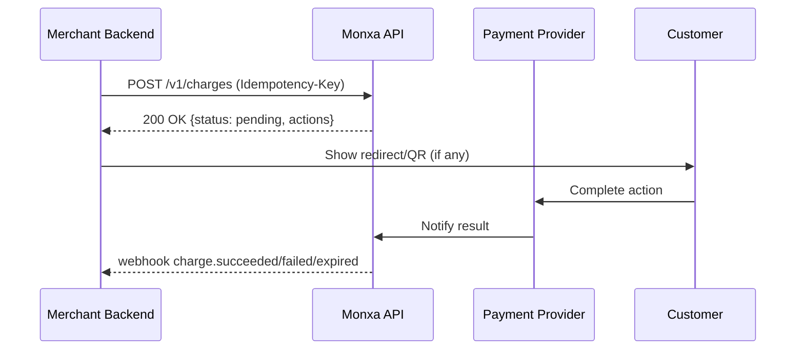
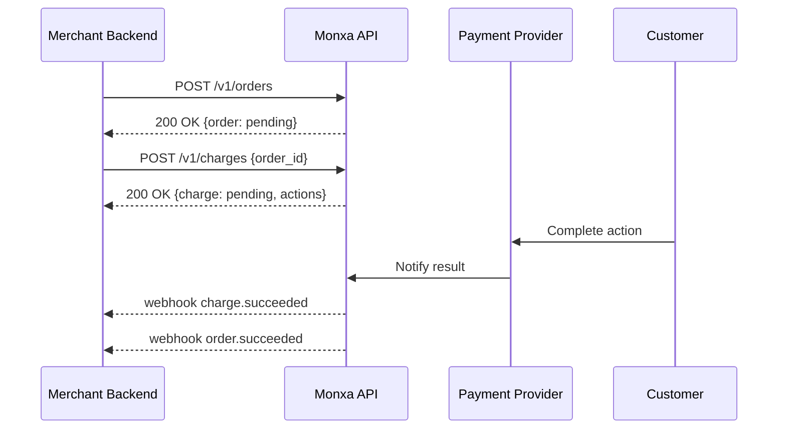

Monxa simplifies accepting payments across Asia with a flexible **Order + Charge** model where **Order is optional**. Integrate either as **Charge-only** (fastest path) or **Order + Charge** (for retries, shared expiry, and unified lifecycle).

---

|                    | Description                                                 | Typical Use Case                                                  |
| :----------------- | :---------------------------------------------------------- | :---------------------------------------------------------------- |
| **Charge only**    | Create and collect payment directly, **no order required**. | One‑off payments, server‑side billing, fastest integration.       |
| **Order + Charge** | Create an order first, then one or more charges under it.   | Checkouts needing retries, shared expiry, consolidated reporting. |

### Option 1: Charge‑only

Create a **Charge** directly (no `order_id`). A charge is a single attempt to collect funds via a specific method (e.g., bank transfer, QRIS, e‑wallet, card).

```http
POST /v1/charges
```

<AccordionGroup>
  <Accordion title="Body Parameters">
    | Field                | Type    | Required    | Description                                                                                                                            |
    | :------------------- | :------ | :---------: | :------------------------------------------------------------------------------------------------------------------------------------- |
    | `amount`             | integer | ✅           | The total amount for which the Order was created. Example: "10000" or "10000.23" for amount with decimal value                         |
    | `currency`           | string  | ✅           | Currency of payment                                                                                                                    |
    | `channel_code`       | string  | ✅           | Payment method code used to select the payment method provider.   Use routing payment channels mapping for full list of channel codes. |
    | `channel_properties` | object  | conditional | Parameters that contain information required by the payment route provider to initiate payment processing.                             |
    | `reference_id`       | string  | optional    | Merchant's payment reference ID                                                                                                        |
    | `order_id`           | string  | optional    | Order ID associated with this charge                                                                                                   |
    | `metadata`           | object  | optional    | Arbitrary key‑value                                                                                                                    |
    | `description`        | string  | optional    | A custom description for the charge.                                                                                                   |
  </Accordion>
</AccordionGroup>

**Example — Charge‑only (QRIS)**

```bash
curl https://api.monxa.co/v1/charges \
  -H "Content-Type: application/json" \
  -H "Idempotency-Key: chg-12345-unique-key" \
  -d '{
    "amount": 150000,
    "currency": "IDR",
    "channel_code": "qris",
    "reference_id": "INV-240001",
    "metadata": { "field_1": "A1234", field_2: "user@example.com" }
  }'
```

**Sample Response**

```json
{
  "id": "chg_01JAB1XYN01P3",
  "reference_id": "INV-240001",
  "amount": 150000,
  "currency": "IDR",
  "status": "pending",
  "channel_code": "qris",
  "actions": {
    "type": "PRESENT_TO_CUSTOMER",
    "qr_data": "00020101021226690012ID...",
	"qr_image": "data:image/png:base64,iVBORw0K...",
    "expires_at": "2025-10-07T09:15:00Z"
  },
  "created_at": "2025-10-07T09:10:00Z"
}
```

**Charge Lifecycle & Actions**

- **Statuses**: `pending`, `succeeded`, `failed`, `expired`, `canceled`
- **Actions enum**
  - `REDIRECT_CUSTOMER` → send user to provider / 3DS page
  - `PRESENT_TO_CUSTOMER` → display QR / VA / instructions
  - `NONE` → no action needed

> **Rules**\
> • A charge has its **own expiry** (`actions.expires_at` where applicable).\
> • Avoid multiple concurrent charges for the **same intent**.\
> • Use **idempotency** and **webhooks** to finalize outcome.

---

### Option 2: Order + Charge

An **Order** represents payment intent and provides a shared lifecycle over multiple attempts (charges). Use when you need retries, consolidated reporting, and global expiry across attempts.

```http
POST /v1/orders
```

<AccordionGroup>
  <Accordion title="Body Parameters">
    | Field              | Type    | Required | Description                     |
    | :----------------- | :------ | :------: | :------------------------------ |
    | `amount`           | integer | ✅        | Minor units                     |
    | `currency`         | string  | ✅        | ISO 4217                        |
    | `customer_id`      | string  | optional | Link to an existing customer    |
    | `allowed_channels` | object  | optional | e.g. "qris", "dana"             |
    | `reference_id`     | string  | optional | Merchant's payment reference ID |
    | `expires_at`       | string  | optional | ISO 8601 timestamp              |
    | `description`      | string  | optional | Human‑readable summary          |
    | `metadata`         | object  | optional | Arbitrary key‑value             |
    | `items`            | object  | optional | Order items                     |
  </Accordion>
</AccordionGroup>

**Sample Response**

```json
{
  "id": "ord_01JAB23PQXYN01P3",
  "amount": 100000,
  "currency": "SGD",
  "status": "open",
  "expires_at": "2025-10-07T12:00:00Z",
  "created_at": "2025-10-07T09:00:00Z"
}
```

Now, create a **Charge** under the order:

```http
POST /v1/charges
```

```bash
curl https://api.monxa.co/v1/charges \
  -H "Content-Type: application/json" \
  -H "Idempotency-Key: cha-ord-123" \
  -d '{
    "order_id": "ord_01JAB23PQXYN01P3",
    "channel_code": "dana",
    "amount": 100000,
    "currency": "SGD"
  }'
```

> **Order rules**\
> • Amount/currency fixed at order creation.\
> • Charge expiry cannot exceed order expiry.\
> • **Only one** successful charge per order.\
> • On first success → order becomes `succeeded`.

---

## 🔔 Webhooks

### Charge‑only events

| Event              | Description                           |
| :----------------- | :------------------------------------ |
| `charge.pending`   | Charge initiated, awaiting completion |
| `charge.succeeded` | Funds confirmed captured              |
| `charge.failed`    | Provider decline or timeout           |
| `charge.expired`   | Charge window elapsed                 |
| `charge.canceled`  | Manually canceled by merchant         |

**`Example — charge.succeeded`**

```json
{
  "id": "evt_01WXYZ",
  "type": "charge.succeeded",
  "data": {
  	"id": "chg_01JAB1XYN01P3",
    "amount": 150000,
    "currency": "IDR",
    "status": "succeeded",
    "collection_type": "qris",
    "reference_id": "INV-240001",
    "captured_at": "2025-10-07T09:11:22Z"
  },
  "created": "2025-10-07T09:11:22Z"
}
```

### Order + Charge events

| Event              | Description                          |
| :----------------- | :----------------------------------- |
| `order.created`    | New order created                    |
| `order.succeeded`  | First charge succeeded; order closed |
| `order.canceled`   | Order canceled by merchant           |
| `order.expired`    | Order reached expiry time            |
| `charge.pending`   | Charge initiated under order         |
| `charge.succeeded` | Charge under order succeeded         |
| `charge.failed`    | Charge under order failed            |

**`Example — order.succeeded`**

```json
{
  "id": "evt_01ABC",
  "type": "order.succeeded",
  "data": {
    "object": {
      "id": "ord_01JAB23PQXYN01P3",
      "amount": 100000,
      "currency": "SGD",
      "status": "succeeded",
      "completed_at": "2025-10-07T09:12:05Z"
    }
  },
  "created": "2025-10-07T09:12:05Z"
}
```

---

## 🧱 Objects & Schemas

### Charge Object

| Field                | Type    | Description                                                                        |
| :------------------- | :------ | :--------------------------------------------------------------------------------- |
| `id`                 | string  | Charge identifier                                                                  |
| `amount`             | integer | Minor units                                                                        |
| `currency`           | string  | ISO 4217                                                                           |
| `status`             | string  | `pending` \| `succeeded` \| `failed` \| `expired` \| `canceled`                    |
| `channel_code`       | string  | Please refer to collection type table (e.g.`qris` \| `dana` \| `bca_va` \| `card`) |
| `channel_properties` | object  | Channel-code specific params (if provided)                                         |
| `reference_id`       | string  | Merchant‑side reference/trace ID                                                   |
| `actions`            | object  | See **Actions enum**                                                               |
| `order_id`           | string  | Present when charge is under an order                                              |
| `customer_id`        | string  | Optional customer linkage                                                          |
| `created_at`         | string  | ISO 8601                                                                           |
| `captured_at`        | string  | ISO 8601 (when succeeded)                                                          |
| `expires_at`         | string  | ISO 8601 (charge window, if any)                                                   |
| `metadata`           | object  | Arbitrary key‑value                                                                |

**`actions object`**

| Field          | Type   | Description                                            |
| :------------- | :----- | :----------------------------------------------------- |
| `type`         | string | `REDIRECT_CUSTOMER` \| `PRESENT_TO_CUSTOMER` \| `NONE` |
| `redirect_url` | string | For redirect flows                                     |
| `qr_data`      | string | For QR flows (e.g., QRIS)                              |
| `qr_image`     | string | Base64 image                                           |
| `va_number`    | string | For virtual account/bank transfer                      |
| `expires_at`   | string | When action becomes invalid                            |

### Order Object

| Field         | Type    | Description                                         |
| :------------ | :------ | :-------------------------------------------------- |
| `id`          | string  | Order identifier                                    |
| `object`      | string  | Always `"order"`                                    |
| `amount`      | integer | Minor units                                         |
| `currency`    | string  | ISO 4217                                            |
| `status`      | string  | `pending` \| `succeeded` \| `canceled` \| `expired` |
| `expires_at`  | string  | Global expiry across attempts                       |
| `created_at`  | string  | ISO 8601                                            |
| `customer_id` | string  | Optional linkage                                    |
| `metadata`    | object  | Arbitrary key‑value                                 |

---

## 🧩 Integration Patterns

### Idempotency

- Send `Idempotency-Key` for all POST creates.
- **Same key + same payload** → safe retry returns the original result.
- New attempt → use a **new key** (and optionally reuse `client_reference_id` for logical grouping).

### Duplicate Prevention

- Never create multiple concurrent charges for the same intent.
- Before retry, **fetch existing charge** to confirm terminal state.

### Pending Methods

- QRIS/VA/Bank transfer may remain `pending` for minutes–hours.
- Always rely on **webhooks**; add mild polling with backoff if needed.

### Security

- Verify webhook signature (`x-monxa-signature` or similar) with your dashboard secret.
- Enforce TLS 1.2+, HTTPS‑only callbacks, and IP allowlist if needed.

> **Note**: Currency and amount are fixed **per charge** in Charge‑only mode; fixed **per order** in Order + Charge mode.

---

## ❗ Errors

| Code                 | HTTP | Message                                  | What to do                                            |
| :------------------- | :--: | :--------------------------------------- | :---------------------------------------------------- |
| `invalid_request`    | 400  | Missing or invalid parameter             | Validate payload; check types/formats                 |
| `conflict`           | 409  | Duplicate request detected               | Use unique `Idempotency-Key` per create               |
| `not_found`          | 404  | Resource not found                       | Check `order_id` / `charge_id` correctness            |
| `method_not_allowed` | 405  | Operation not permitted in current state | Check status and flow rules                           |
| `provider_declined`  | 402  | Payment declined by provider             | Show retry/alternate method                           |
| `expired`            | 410  | Order/Charge expired                     | Create a new order/charge                             |
| `rate_limited`       | 429  | Too many requests                        | Backoff and retry                                     |
| `internal_error`     | 500  | Unexpected error                         | Retry with idempotency; contact support if persistent |

**Error Response Sample**

```json
{
  "error": {
    "code": "invalid_request",
    "message": "amount must be >= 1",
    "param": "amount",
    "request_id": "req_01XYZ"
  }
}
```

## High‑Level Flows

### Charge‑only



### Order + Charge

