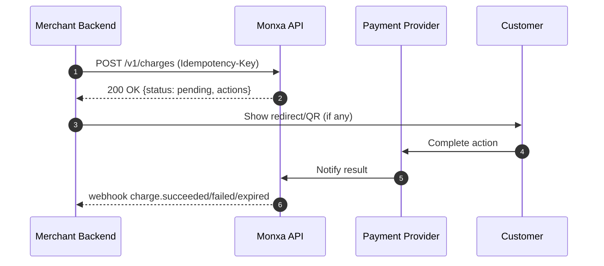
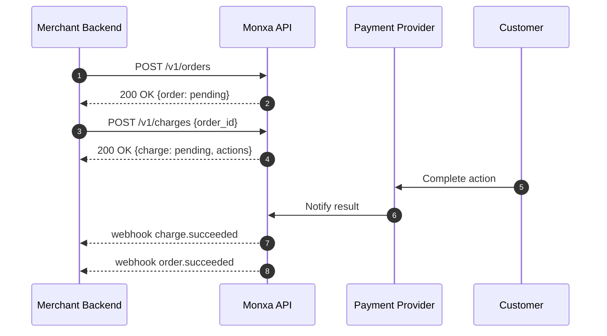

Monxa simplifies accepting payments across Asia with a flexible **Order + Charge** model where **Order is optional**. Integrate either as **Charge-only** (fastest path) or **Order + Charge** (for retries, shared expiry, and unified lifecycle).

| Options            | Description                                                 | Typical Use Case                                                  |
| :----------------- | :---------------------------------------------------------- | :---------------------------------------------------------------- |
| **Charge only**    | Create and collect payment directly, **no order required**. | One‑off payments, server‑side billing, fastest integration.       |
| **Order + Charge** | Create an order first, then one or more charges under it.   | Checkouts needing retries, shared expiry, consolidated reporting. |

---

### Option 1: Charge‑only

Create a **Charge** directly (no `order_id`). A charge is a single attempt to collect funds via a specific method (e.g., bank transfer, QRIS, e‑wallet, card).



```http
POST /v1/charges
```

<AccordionGroup>
  <Accordion title="Body Parameters">
    | Field                | Type    | Required    | Description                                                                                                                     |
    | :------------------- | :------ | :---------: | :------------------------------------------------------------------------------------------------------------------------------ |
    | `amount`             | integer | ✅           | The total amount for which the payment  was created. Example: "10000" or "10000.23" for amount with decimal value               |
    | `currency`           | string  | ✅           | Currency of payment                                                                                                             |
    | `channel_code`       | string  | ✅           | Channel code used to select the payment method provider.   Use routing payment channels mapping for full list of channel codes. |
    | `channel_properties` | object  | conditional | Parameters that contain information required by the payment route provider to initiate payment processing.                      |
    | `reference_id`       | string  | optional    | Merchant's payment reference ID                                                                                                 |
    | `order_id`           | string  | optional    | Order ID associated with this charge                                                                                            |
    | `metadata`           | object  | optional    | Arbitrary key‑value                                                                                                             |
    | `description`        | string  | optional    | A custom description for the charge.                                                                                            |
  </Accordion>
  <Accordion title="Request Example : Charge‑only (QRIS)">
    ```bash
    curl https://api.monxa.io/v1/charges \
      -H "Content-Type: application/json" \
      -H "Idempotency-Key: chg-12345-unique-key" \
      -d '{
        "amount": 150000,
        "currency": "IDR",
        "channel_code": "qris",
        "reference_id": "INV-240001",
        "metadata": { "field_1": "A1234", field_2: "user@example.com" }
      }'
    ```
  </Accordion>
  <Accordion title="Response Example">
    ```json
    {
      "id": "chg_01JAB1XYN01P3",
      "reference_id": "INV-240001",
      "amount": 150000,
      "currency": "IDR",
      "status": "pending",
      "channel_code": "qris",
      "actions": {
        "type": "PRESENT_TO_CUSTOMER",
        "qr_data": "00020101021226690012ID...",
    	"qr_image": "data:image/png:base64,iVBORw0K...",
        "expires_at": "2025-10-07T09:15:00Z"
      },
      "created_at": "2025-10-07T09:10:00Z"
    }
    ```
  </Accordion>
  <Accordion title="Charge Lifecycle & Actions">
    - **Statuses**: `pending`, `succeeded`, `failed`, `expired`, `canceled`
    - **Actions enum**
      - `REDIRECT_CUSTOMER` → send customer to provider / 3DS page
      - `PRESENT_TO_CUSTOMER` → display QR / VA / instructions
      - `NONE` → no action needed

    > **Rules**\
    > • A charge has its **own expiry** (`actions.expires_at` where applicable).\
    > • Avoid multiple concurrent charges for the **same intent**.\
    > • Use **idempotency** and **webhooks** to finalize outcome.
  </Accordion>
</AccordionGroup>

---

### Option 2: Order + Charge

An **Order** represents payment intent and provides a shared lifecycle over multiple attempts (charges). Use when you need retries, consolidated reporting, and global expiry across attempts.



```http
POST /v1/orders
```

<AccordionGroup>
  <Accordion title="Body Parameters">
    | Field              | Type    | Required | Description                     |
    | :----------------- | :------ | :------: | :------------------------------ |
    | `amount`           | integer | ✅        | Minor units                     |
    | `currency`         | string  | ✅        | ISO 4217                        |
    | `customer_id`      | string  | optional | Link to an existing customer    |
    | `allowed_channels` | object  | optional | e.g. "qris", "dana"             |
    | `reference_id`     | string  | optional | Merchant's payment reference ID |
    | `expires_at`       | string  | optional | ISO 8601 timestamp              |
    | `description`      | string  | optional | Human‑readable summary          |
    | `metadata`         | object  | optional | Arbitrary key‑value             |
    | `items`            | object  | optional | Order items                     |
  </Accordion>
  <Accordion title="Request Example : Create Order">
    ```cUrl
    curl -X POST "https://api.monxa.co/v1/orders" \
    -H "Content-Type: application/json" \
    -H "Authorization: Bearer YOUR_API_KEY" \
    -H "Idempotency-Key: your-unique-idempotency-key" \
    -d '{
    "amount": 500000,
    "currency": "IDR",
    "customer_id": "cust_abc123",
    "allowed_channels": ["dana", "qris"],
    "reference_id": "order-ref-0001",
    "expires_at": "2025-10-30T15:00:00Z",
    "description": "Purchase of item #1234",
    "metadata": {
      "user_id": "user789",
      "campaign": "fall_sale"
    },
    "items": [
      {
        "name": "Cool Widget",
        "quantity": 2,
        "unit_price": 2500,
        "metadata": {
          "sku": "CW-001"
        }
      }
    ]
    }'
    ```
  </Accordion>
  <Accordion title="Response Example">
    ```json
    {
      "id": "ord_01JAB23PQXYN01P3",
      "amount": 100000,
      "currency": "SGD",
      "status": "open",
      "expires_at": "2025-10-07T12:00:00Z",
      "created_at": "2025-10-07T09:00:00Z"
    }
    ```
  </Accordion>
</AccordionGroup>

Now, create a **Charge** under the order:

```http
POST /v1/charges
```

```bash
curl https://api.monxa.io/v1/charges \
  -H "Content-Type: application/json" \
  -H "Idempotency-Key: chg-ord-123" \
  -d '{
    "order_id": "ord_01JAB23PQXYN01P3",
    "channel_code": "dana",
    "amount": 500000,
    "currency": "IDR"
  }'
```

> **Order rules**\
> • Amount / currency fixed at order creation.\
> • Charge expiry cannot exceed order expiry.\
> • **Only one** successful charge per order.\
> • On first success → order becomes `succeeded`.

---

## Webhooks

<AccordionGroup>
  <Accordion title="Charge‑only Events">
    | Event              | Description                           |
    | :----------------- | :------------------------------------ |
    | `charge.pending`   | Charge initiated, awaiting completion |
    | `charge.succeeded` | Funds confirmed captured              |
    | `charge.failed`    | Provider decline or timeout           |
    | `charge.expired`   | Charge window elapsed                 |
    | `charge.canceled`  | Manually canceled by merchant         |
  </Accordion>
  <Accordion title="Example : charge.succeeded">
    ```json
    {
    	"id": "evt_01WXYZ",
    	"type": "charge.succeeded",
    	"data": {
    		"id": "chg_01JAB1XYN01P3",
    		"amount": 150000,
    		"currency": "IDR",
    		"status": "succeeded",
    		"channel_code": "qris",
    		"reference_id": "INV-240001",
    		"captured_at": "2025-10-07T09:11:22Z"
    	},
    	"created": "2025-10-07T09:11:22Z"
    }
    ```
  </Accordion>
</AccordionGroup>

<AccordionGroup>
  <Accordion title="Order + Charge Events">
    | Event              | Description                          |
    | :----------------- | :----------------------------------- |
    | `order.created`    | New order created                    |
    | `order.succeeded`  | First charge succeeded; order closed |
    | `order.canceled`   | Order canceled by merchant           |
    | `order.expired`    | Order reached expiry time            |
    | `charge.pending`   | Charge initiated under order         |
    | `charge.succeeded` | Charge under order succeeded         |
    | `charge.failed`    | Charge under order failed            |
  </Accordion>
  <Accordion title="Example : order.succeeded">
    ```json
    {
      "id": "evt_01ABC",
      "type": "order.succeeded",
      "data": {
        "object": {
          "id": "ord_01JAB23PQXYN01P3",
          "amount": 100000,
          "currency": "SGD",
          "status": "succeeded",
          "completed_at": "2025-10-07T09:12:05Z"
        }
      },
      "created": "2025-10-07T09:12:05Z"
    }
    ```
  </Accordion>
</AccordionGroup>

## Objects & Schemas

<AccordionGroup>
  <Accordion title="Charge Object">
    | Field                | Type    | Description                                                                        |
    | :------------------- | :------ | :--------------------------------------------------------------------------------- |
    | `id`                 | string  | Charge identifier                                                                  |
    | `amount`             | integer | Minor units                                                                        |
    | `currency`           | string  | ISO 4217                                                                           |
    | `status`             | string  | `pending` \| `succeeded` \| `failed` \| `expired` \| `canceled`                    |
    | `channel_code`       | string  | Please refer to collection type table (e.g.`qris` \| `dana` \| `bca_va` \| `card`) |
    | `channel_properties` | object  | Channel-code specific params (if provided)                                         |
    | `reference_id`       | string  | Merchant‑side reference/trace ID                                                   |
    | `actions`            | object  | See **Actions enum**                                                               |
    | `order_id`           | string  | Present when charge is under an order                                              |
    | `customer_id`        | string  | Optional customer linkage                                                          |
    | `created_at`         | string  | ISO 8601                                                                           |
    | `captured_at`        | string  | ISO 8601 (when succeeded)                                                          |
    | `expires_at`         | string  | ISO 8601 (charge window, if any)                                                   |
    | `metadata`           | object  | Arbitrary key‑value                                                                |
  </Accordion>
  <Accordion title="Order Object">
    | Field         | Type    | Description                                         |
    | :------------ | :------ | :-------------------------------------------------- |
    | `id`          | string  | Order identifier                                    |
    | `object`      | string  | Always `"order"`                                    |
    | `amount`      | integer | Minor units                                         |
    | `currency`    | string  | ISO 4217                                            |
    | `status`      | string  | `pending` \| `succeeded` \| `canceled` \| `expired` |
    | `expires_at`  | string  | Global expiry across attempts                       |
    | `created_at`  | string  | ISO 8601                                            |
    | `customer_id` | string  | Optional linkage                                    |
    | `metadata`    | object  | Arbitrary key‑value                                 |
  </Accordion>
</AccordionGroup>