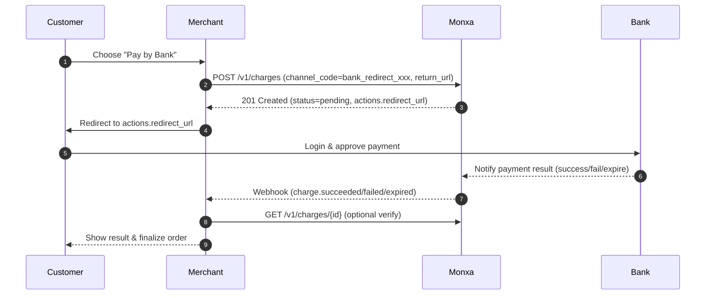

**Bank Redirects** allow customers to complete payments by logging into their online banking system. Instead of entering card details, customers are securely redirected to their bank or a banking switch (e.g., FPX, Pay by Bank) to authorize the transaction. Once approved, they are returned to your site or app, and Monxa confirms the result via webhooks.

This method is widely used across Asia for its **security, customer familiarity, and high success rates**, making it an effective alternative to card payments.

## Capabilities & Constraints

- **Flow type:** Redirect to bank or bank switch; result confirmed by webhook.
- **Capture model:** **Direct capture only** (no separate auth/capture).
- **Customer experience:** Bank login → approve payment → redirect/return.
- **Settlement:** According to the connected provider/bank switch.
- **Refunds:** Supported by many providers **after capture** (rules vary; see matrix below). No “reversal”/void once bank has posted the debit.
- **Retries:** If abandoned/expired, create a **new charge** with a new `Idempotency-Key`.

## Typical Use Cases

- E-commerce checkout where card conversion is low
- High-trust domestic bank rails (e.g., Malaysia FPX-style, SG pay-by-bank)
- Desktop/mobile flows where redirect is acceptable

<Columns cols={2}>
  <Card title="1. Create a Charge" icon="star" iconType="solid" href="#">
    Initiate the payment by creating a **charge** in your system with the transaction details.
  </Card>
  <Card title="2. Redirect the Customer" icon="diamond-turn-right" iconType="solid" href="#">
    Use the `return_url` from Monxa to send the customer to their bank app.
  </Card>
  <Card title="3. Customer Approves at Bank App" icon="mobile-screen-button" iconType="solid" href="#">
    The customer confirms the transaction by entering their **PIN/OTP** or using biometric authentication in their bank app.
  </Card>
  <Card title="4. Handle Webhooks" icon="anchor" iconType="solid" href="#">
    Once the e-wallet provider processes the payment, Monxa sends a **webhook notification** to update your system with the final status.
  </Card>
</Columns>

## Supported Channels

<Tabs>
  <Tab title="🇲🇾 Malaysia">
    | Channel              | Code            | **Currency** | **Refund** | **Settlement** | Min Amount | Max  Amount  |
    | :------------------- | :-------------- | :----------- | :--------- | :------------- | :--------- | :----------- |
    | Affin Bank           | `bank_affin`    | MYR          | N.A        | T+2            | 1          | 1000,000,000 |
    | Agro Bank            | `bank_agro`     | MYR          | N.A        | T+2            | 1          | 1000,000,000 |
    | Alliance Bank        | `bank_alliance` | MYR          | N.A        | T+2            | 1          | 1000,000,000 |
    | Am Bank              | `bank_am`       | MYR          | N.A        | T+2            | 1          | 1000,000,000 |
    | BNP Bank             | `bank_bnp`      | MYR          | N.A        | T+2            | 1          | 1000,000,000 |
    | Bank Of China        | `bank_boc`      | MYR          | N.A        | T+2            | 1          | 1000,000,000 |
    | BSN                  | `bank_bsn`      | MYR          | N.A        | T+2            | 1          | 1000,000,000 |
    | CIMB                 | `bank_cimb`     | MYR          | N.A        | T+2            | 1          | 1000,000,000 |
    | Citibank             | `bank_citi`     | MYR          | N.A        | T+2            | 1          | 1000,000,000 |
    | Deutsche Bank        | `bank_deutsche` | MYR          | N.A        | T+2            | 1          | 1000,000,000 |
    | Hong Leong Bank      | `bank_hlb`      | MYR          | N.A        | T+2            | 1          | 1000,000,000 |
    | HSBC                 | `bank_hsbc`     | MYR          | N.A        | T+2            | 1          | 1000,000,000 |
    | Islam Bank           | `bank_islam`    | MYR          | N.A        | T+2            | 1          | 1000,000,000 |
    | Kuwait Finance House | `bank_kuwait`   | MYR          | N.A        | T+2            | 1          | 1000,000,000 |
    | Maybank              | `bank_maybank`  | MYR          | N.A        | T+2            | 1          | 1000,000,000 |
    | Bank Mualamat        | `bank_mualamat` | MYR          | N.A        | T+2            | 1          | 1000,000,000 |
    | OCBC                 | `bank_ocbc`     | MYR          | N.A        | T+2            | 1          | 1000,000,000 |
    | Public Bank          | `bank_public`   | MYR          | N.A        | T+2            | 1          | 1000,000,000 |
    | Bank Rakyat          | `bank_rakyat`   | MYR          | N.A        | T+2            | 1          | 1000,000,000 |
    | RHB Bank             | `bank_rhb`      | MYR          | N.A        | T+2            | 1          | 1000,000,000 |
    | Standard Chartered   | `bank_scb`      | MYR          | N.A        | T+2            | 1          | 1000,000,000 |
    | UOB                  | `bank_uob`      | MYR          | N.A        | T+2            | 1          | 1000,000,000 |
  </Tab>
  <Tab title="🇹🇭 Thailand">
    
  </Tab>
</Tabs>

## Payment Flow



### Status Lifecycle

| Status        | When                                 | Merchant Action                     |
| ------------- | ------------------------------------ | ----------------------------------- |
| **pending**   | Charge created; awaiting bank result | Redirect customer; wait for webhook |
| **succeeded** | Bank confirmed & funds captured      | Fulfill order                       |
| **failed**    | Bank/customer canceled or error      | Offer retry / alternate method      |
| **expired**   | Session timed out at bank/switch     | Create a new charge if needed       |

### Field Reference

| Field                             | Type        | Required | Notes                                                                       |
| :-------------------------------- | :---------- | :------- | :-------------------------------------------------------------------------- |
| **amount**                        | integer     | ✓        | Minor units.                                                                |
| **currency**                      | string      | ✓        | ISO-4217 (e.g., MYR, SGD, THB).                                             |
| **reference_id**                  | string      | ✓        | Your order/invoice reference.                                               |
| **channel_code**                  | string      | ✓        | e.g., `bank_redirect_fpx`, `bank_redirect_sgpaybybank`, `bank_redirect_th`. |
| **channel_properties.return_url** | string(url) | ✓        | Where we return the customer after bank flow.                               |
| **channel_properties.cancel_url** | string(url) |          | Where to send customer if they cancel (if supported).                       |
| **channel_properties.bank_code**  | string      |          | Preselect a bank (provider-dependent).                                      |
| **metadata**                      | object      |          | Freeform key-value pairs.                                                   |
| **Header: Idempotency-Key**       | string      | ✓        | Unique per create attempt to avoid duplicates.                              |

### Step 1: Create a Charge

Create a charge with a bank-redirect `channel_code`. Include a `return_url` (required) to bring the customer back to your site/app.

<Tip>
  **Endpoint: POST v1/charges**
</Tip>

<AccordionGroup>
  <Accordion title="Request Example : Malaysia - FPX-like switch)">
    ```bash
    curl https://api.monxa.io/v1/charges \
      -H "Authorization: Bearer sk_test_***" \
      -H "Content-Type: application/json" \
      -H "Idempotency-Key: chg-2025-10-09-0001" \
      -d '{
        "amount": 2500,
        "currency": "MYR",
        "reference_id": "INV-2025-1009-001",
        "channel_code": "bank_fpx",
        "channel_properties": {
          "return_url": "https://merchant.example.com/checkout/return",
          "cancel_url": "https://merchant.example.com/checkout/cancel"
        },
        "metadata": {
          "order_note": "Black Friday order #8841"
        }
      }'
    ```
  </Accordion>
  <Accordion title="Response Example">
    ```json
    {
      "id": "chg_01JBB3MZQ8Q2X",
      "object": "charge",
      "reference_id": "INV-2025-1009-001",
      "amount": 250000,
      "currency": "MYR",
      "status": "pending",
      "channel_code": "bank_fpx",
      "actions": {
        "type": "REDIRECT_CUSTOMER",
        "redirect_url": "https://bank-switch.example/session/S_abc123",
        "expires_at": "2025-10-09T05:25:00Z"
      },
      "created_at": "2025-10-09T05:20:00Z"
    }
    ```
  </Accordion>
</AccordionGroup>

<Note>
  Why **pending**? The payment is not approved yet. Final state is delivered via webhook after the customer completes at their bank.
</Note>

### Step 2: Redirect the Customer

Send the customer to `actions.redirect_url`.

- **Web:** Perform a 302 redirect or render a “Continue to your bank” button linking to `redirect_url`.
- **Mobile:** Open in external browser or in-app webview. Handle the `return_url` to resume your flow.

### Step 3: Customer Approves at Bank

The customer authenticates with their bank and approves the payment. The bank/switch posts the result back to Monxa.

- If successful → funds are **captured** and status becomes `succeeded`.
- If rejected/canceled → status becomes `failed`.
- If not completed in time → status becomes `expired`.

<Tip>
  Always verify by fetching the charge: **GET /v1/charges/**
</Tip>

### Step 4: Handle Webhooks & Update Payment Status

<Tip>
  Always verify the event by fetching the charge (**GET /v1/charges/**) before updating your system.
</Tip>

<AccordionGroup>
  <Accordion title="Sample Webhook (charge.succeeded)">
    ```json
    {
    	"id": "evt_01JBB3S1RZK8N",
      	"type": "charge.succeeded",
      	"data": {
        	"id": "chg_01JBB3MZQ8Q2X",
        	"reference_id": "INV-2025-1009-001",
        	"amount": 250000,
        	"currency": "MYR",
        	"status": "succeeded",
        	"channel_code": "bank_redirect_fpx",
        	"captured_at": "2025-10-09T05:21:12Z"
    	},
      	"created_at": "2025-10-09T05:21:13Z"
    }
    ```
  </Accordion>
  <Accordion title="Sample Webhook (charge.failed)">
    ```json
    {
    	"id": "evt_01JBB3FAIL001",
      	"type": "charge.failed",
      	"data": {
        	"id": "chg_01JBB3MZQ8Q2X",
        	"reference_id": "INV-2025-1009-001",
        	"status": "failed",
        	"failure_code": "bank_declined",
        	"failure_message": "Customer canceled or bank declined"
      	},
    	"created_at": "2025-10-09T05:22:40Z"
    }
    ```
  </Accordion>
</AccordionGroup>

## Implementation Tips

- **UI:** Always show a “Continue to your bank” CTA and a fallback “Try another method.”
- **Timeouts:** Respect `actions.expires_at`; show session countdowns to reduce abandonment.
- **Mobile deep-linking:** Some providers return app deep links; handle gracefully with browser fallback.
- **Reconciliation:** Store `charge.id`, `reference_id`, bank `bank_code` (if present), and webhook timestamps.

## Error Handling

| Error                            | Meaning                                          | How to Resolve                          |
| :------------------------------- | :----------------------------------------------- | :-------------------------------------- |
| `400 invalid_channel_properties` | Missing/invalid `return_url` or `bank_code`      | Provide required fields; validate URLs  |
| `400 unsupported_channel`        | Channel not enabled or not available in corridor | Enable channel or choose supported one  |
| `402 bank_declined`              | Bank rejected the payment                        | Offer retry/alternative method          |
| `409 duplicate_reference`        | `reference_id` uniqueness conflict (if enforced) | Use a unique reference or update config |
| `422 amount_mismatch`            | Amount not accepted by provider                  | Ensure correct minor units and limits   |