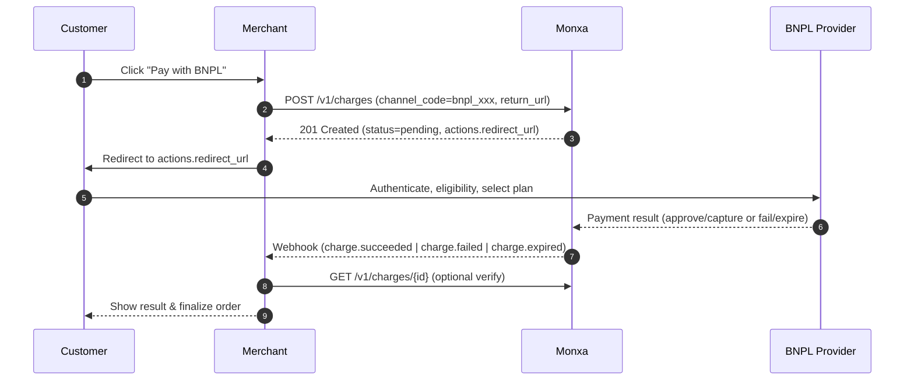

**Buy Now, Pay Later (BNPL)** allows your customers to split their purchases into multiple instalments — while you receive the payment in full once the provider confirms the transaction.\
It’s a popular financing option that improves conversion rates and average order values by offering customers greater payment flexibility without upfront burden.

Monxa’s BNPL integration simplifies the process by standardizing diverse provider APIs into a unified **Charge API** experience. Developers can enable multiple BNPL providers (e.g., Atome, Kredivo, PayLater) using the same flow, parameters, and webhook structure — without worrying about each provider’s technical nuances.

BNPL payments on Monxa are **direct-capture only**, meaning that once the customer confirms the payment plan with the provider, the transaction is immediately captured. There is no authorisation or delayed capture step. Refunds, if supported, are handled through Monxa’s **Refund API**, and settlement follows the provider’s remittance schedule to your Monxa Balance or bank account.

## Key Benefits

- 💳 **Increase conversion:** Offer instalment options at checkout for affordability.
- 🛒 **Higher order value:** Customers are more likely to spend more when paying later.
- ⚙️ **Unified API:** Same request/response structure across providers and regions.
- 🧾 **Automatic capture:** Simplifies fulfilment since funds are captured immediately.
- 🔄 **Refund support:** Full or partial refunds available depending on provider policy.
- 🌏 **Regional reach:** Support for major BNPL providers in Southeast Asia and beyond

<Columns cols={2}>
  <Card title="1. Create a Charge" icon="star" iconType="solid" href="#">
    Initiate the payment by creating a **charge** in your system with the transaction details.
  </Card>
  <Card title="2. Redirect Customer to e-Wallet" icon="diamond-turn-right" iconType="solid" href="#">
    Use the `return_url` from Monxa to send the customer to their e-wallet app or hosted page.
  </Card>
  <Card title="3. Customer Authorizes Payment" icon="mobile-screen-button" iconType="solid" href="#">
    The customer confirms the transaction by entering their **PIN/OTP** or using biometric authentication in their e-wallet.
  </Card>
  <Card title="4. Handle Webhooks" icon="anchor" iconType="solid" href="#">
    Once the e-wallet provider processes the payment, Monxa sends a **webhook notification** to update your system with the final status.
  </Card>
</Columns>

## Supported Channels

<Tabs>
  <Tab title="🇮🇩 Indonesia">
    | Channel  | Code            | **Currency** | **Refund** | **Settlement** | Min Amount | Max  Amount |
    | :------- | --------------- | :----------- | :--------- | :------------- | ---------- | :---------- |
    | Kredivo  | `bnpl_kredivo`  | IDR          | Full       | T+4            | 1,000      | 30,000,000  |
    | Akulaku  | `bnpl_akulaku`  | IDR          | Full       | T+2            | 1,000      | 25,000,000  |
    | Atome    | `bnpl_atome`    | IDR          | Full       | T+2            | 50,000     | 6,000,000   |
    | Indodana | `bnpl_indodana` | IDR          | Full       | T+2            | 10,000     | 25,000,000  |
  </Tab>
</Tabs>

## Payment Flow



### Status Lifecycle (BNPL)

| Monxa Status  | When it Occurs                                 | Merchant Action                     |
| :------------ | :--------------------------------------------- | :---------------------------------- |
| **pending**   | Charge created; awaiting provider approval     | Redirect customer; wait for webhook |
| **succeeded** | Provider approved & captured                   | Fulfill order                       |
| **failed**    | Provider rejected / canceled / technical error | Offer retry or alternate method     |
| **expired**   | Customer did not complete within session       | Create a new charge if neede        |

### Step 1: Create a Charge

Create a charge with a BNPL `channel_code` (examples: `bnpl_atome`, `bnpl_kredivo`, etc.) and include a `return_url` so we can return customers to your site/app after they complete the BNPL flow.

<Tip>
  **Endpoint: POST /v1/charges**
</Tip>

<AccordionGroup>
  <Accordion title="Request Parameters" iconType="solid">
    | Parameter              | Type   | Required    | Description                                                                                                                                                                                                                   |
    | :--------------------- | :----- | :---------- | :---------------------------------------------------------------------------------------------------------------------------------------------------------------------------------------------------------------------------- |
    | **amount**             | string | required    | The amount to be paid.                                                                                                                                                                                                        |
    | **currency**           | string | required    | The currency of the payment (e.g., “sgd”).                                                                                                                                                                                    |
    | **channel_code**       | string | required    | Payment method code used to select the payment method provider.  (e.g. "qr_qris").                                                                                                                                            |
    | **channel_properties** | object | conditional | Parameters that contain information required by the payment route provider to initiate payment processing.                                                                                                                    |
    | reference_id           | string | optional    | Merchant's payment reference ID                                                                                                                                                                                               |
    | order_id               | string | optional    | Order ID in Monxa associated with this charge                                                                                                                                                                                 |
    | customer_id            | string | optional    | Customer ID in Monxa associated with this charge                                                                                                                                                                              |
    | description            | string | optional    | A custom description for the charge.                                                                                                                                                                                          |
    | metadata               | object | optional    | Key-value entries for your custom data.   You can specify up to 50 keys, with key names up to 40 characters and values up to 500 characters.   This is for your convenience. Monxa will not use this data for any processing. |
  </Accordion>
  <Accordion title="Request Example">
    ```bash
    curl https://api.monxa.io/v1/charges \
      -H "Content-Type: application/json" \
      -H "Authorization: Bearer sk_test_***" \
      -H "Idempotency-Key: chg-12345-unique-key" \
      -d '{
        "amount": 150000,
        "currency": "IDR",
        "reference_id": "INV-240001",
        "channel_code": "bnpl_atome",
        "channel_properties": {
          "return_url": "https://merchant.example.com/checkout/return"
        },
        "metadata": {
          "field_1": "A1234",
          "field_2": "user@example.com"
        }
      }'
    ```
  </Accordion>
  <Accordion title="Response Example">
    <Tip>
      The response includes a qr_data that contains the information needed to generate a scannable QR code (qr_data).
    </Tip>
    ```json
    {
      "id": "chg_01JAB1XYN01P3",
      "object": "charge",
      "reference_id": "INV-240001",
      "amount": 150000,
      "currency": "IDR",
      "status": "pending",
      "channel_code": "bnpl_atome",
      "actions": {
        "type": "REDIRECT_CUSTOMER",
        "redirect_url": "https://bnpl.example.com/checkout/SESSION_abc123",
        "expires_at": "2025-10-07T09:15:00Z"
      },
      "created_at": "2025-10-07T09:10:00Z"
    }
    ```
  </Accordion>
</AccordionGroup>

### Step 2: Redirect the Customer

Use `actions.redirect_url` to send the customer to the BNPL provider’s hosted checkout. Do **not** generate a QR code—BNPL is a **redirect + hosted authentication** flow (KYC/eligibility and plan selection happen on the provider’s side).

- **Web:** HTTP 302 or client-side redirect.
- **Mobile:** Open in an in-app webview or external browser; handle the `return_url` to resume your flow.

### Step 3: Customer Authorizes & Selects a Plan

On the provider page, the customer:

1. Logs in or signs up (provider KYC/eligibility).
2. Selects an installment plan (tenor/fees shown by the provider).
3. Confirms the payment.

If approved, the provider **captures** the amount (direct capture) and we update the charge status.

### Step 4: Handle Webhooks & Update Your Order

Rely on webhooks to make authoritative updates to your order or fulfillment state.

**Key events**

- `charge.succeeded` — BNPL approved & **captured**; safe to deliver goods/services.
- `charge.failed` — Rejected, canceled, or provider error.
- `charge.expired` — Customer didn’t complete within the session window.
- `refund.succeeded` / `refund.failed` — If you initiate a refund later (subject to provider rules).

<Tip>
  Always verify the event by fetching the charge (**GET /v1/charges/**) before updating your system.
</Tip>

<AccordionGroup>
  <Accordion title="Sample Webhook (charge.succeeded)">
    ```json
    {
    	"id": "evt_01JAB9ABCDEF",
    	"type": "charge.succeeded",
    	"data": {
    		"id": "chg_01JAB1XYN01P3",
    		"reference_id": "INV-240001",
    		"amount": 150000,
    		"currency": "IDR",
    		"status": "succeeded",
    		"channel_code": "bnpl_atome",
    		"captured_at": "2025-10-07T09:11:45Z"
    	},
    	"created_at": "2025-10-07T09:11:46Z"
    }
    ```
  </Accordion>
  <Accordion title="Sample Webhook (charge.failed)">
    ```json
    {
    	"id": "evt_01JAB9FAIL001",
    	"type": "charge.failed",
    	"data": {
    		"id": "chg_01JAB1XYN01P3",
    		"reference_id": "INV-240001",
    		"status": "failed",
    		"failure_code": "provider_declined",
    		"failure_message": "Customer not eligible for requested plan"
    	},
    	"created_at": "2025-10-07T09:12:10Z"
    }
    ```
  </Accordion>
</AccordionGroup>

## Refunds (Provider-Dependent)

- **Supported:** Usually allowed post-capture; **partial** refunds may be supported depending on the BNPL provider and time window.
- **Not Supported / Window Lapsed:** Some providers restrict partial refunds or disallow refunds beyond a certain number of days.
- **API:** Use `POST /v1/refunds` with `charge_id`, `amount` (optional for partial), and `reason`. Monitor `refund.succeeded` / `refund.failed`.

  <Tip>
    For operational certainty, maintain a BNPL provider matrix in your ops/wallet config (flags for supports_partial_refund, refund_window_days, fees, etc.).
  </Tip>

## Error Handling & Retries

- **Idempotency:** Always set a unique `Idempotency-Key` per create attempt. Reuse the same key on client/network retries to avoid double charges.
- **Common errors:**
  - `400 invalid_channel_properties` — Missing/invalid `return_url`.
  - `400 unsupported_channel` — BNPL provider not enabled for your account/country.
  - `402 provider_declined` — Eligibility/credit check failed.
  - `409 duplicate_reference` — If your environment enforces unique `reference_id`.
- **Recovery:** On `failed`/`expired`, offer retry (create a **new** charge with a fresh `Idempotency-Key`).