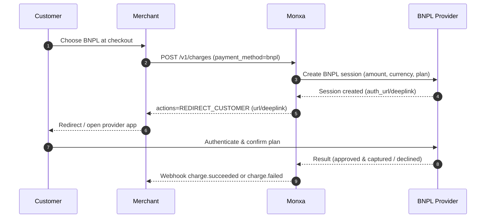

**Buy Now, Pay Later (BNPL)** allows your customers to split their purchases into multiple instalments — while you receive the payment in full once the provider confirms the transaction.\
It’s a popular financing option that improves conversion rates and average order values by offering customers greater payment flexibility without upfront burden.

Monxa’s BNPL integration simplifies the process by standardizing diverse provider APIs into a unified **Charge API** experience. Developers can enable multiple BNPL providers (e.g., Atome, Kredivo, PayLater) using the same flow, parameters, and webhook structure — without worrying about each provider’s technical nuances.

BNPL payments on Monxa are **direct-capture only**, meaning that once the customer confirms the payment plan with the provider, the transaction is immediately captured. There is no authorisation or delayed capture step. Refunds, if supported, are handled through Monxa’s **Refund API**, and settlement follows the provider’s remittance schedule to your Monxa Balance or bank account.

## Key Benefits

- 💳 **Increase conversion:** Offer instalment options at checkout for affordability.
- 🛒 **Higher order value:** Customers are more likely to spend more when paying later.
- ⚙️ **Unified API:** Same request/response structure across providers and regions.
- 🧾 **Automatic capture:** Simplifies fulfilment since funds are captured immediately.
- 🔄 **Refund support:** Full or partial refunds available depending on provider policy.
- 🌏 **Regional reach:** Support for major BNPL providers in Southeast Asia and beyond

<Columns cols={2}>
  <Card title="1. Create a Charge" icon="star" iconType="solid" href="#">
    Initiate the payment by creating a **charge** in your system with the transaction details.

       
  </Card>
  <Card title="2. Redirect Customer to e-Wallet" icon="diamond-turn-right" iconType="solid" href="#">
    Use the `return_url` from Monxa to send the customer to their e-wallet app or hosted page.
  </Card>
  <Card title="3. Customer Authorizes Payment" icon="mobile-screen-button" iconType="solid" href="#">
    The customer confirms the transaction by entering their **PIN/OTP** or using biometric authentication in their e-wallet.

      
  </Card>
  <Card title="4. Handle Webhooks" icon="anchor" iconType="solid" href="#">
    Once the e-wallet provider processes the payment, Monxa sends a **webhook notification** to update your system with the final status.
  </Card>
</Columns>

## Supported Channels

<Tabs>
  <Tab title="🇮🇩 Indonesia">
    | Channel  | Code            | **Currency** | **Refund** | **Settlement** | Min Amount | Max  Amount |
    | :------- | --------------- | :----------- | :--------- | :------------- | ---------- | :---------- |
    | Kredivo  | `kredivo_bnpl`  | IDR          | Full       | T+4            | 1,000      | 30,000,000  |
    | Akulaku  | `akulaku_bnpl`  | IDR          | Full       | T+2            | 1,000      | 25,000,000  |
    | Atome    | `atome_bnpl`    | IDR          | Full       | T+2            | 50,000     | 6,000,000   |
    | Indodana | `indodana_bnpl` | IDR          | Full       | T+2            | 10,000     | 25,000,000  |
  </Tab>
</Tabs>

## Payment Flow



### Step 1: Create a Charge

This is the initial stage of the payment process. After gathering all the user’s details and preparing to collect payment, use this API to generate a **charge**.

<Tip>
  **Endpoint: POST v1/charges**
</Tip>

<AccordionGroup>
  <Accordion title="Request Parameters" iconType="solid">
    | Parameter              | Type   | Required    | Description                                                                                                                                                                                                                   |
    | :--------------------- | :----- | :---------- | :---------------------------------------------------------------------------------------------------------------------------------------------------------------------------------------------------------------------------- |
    | **amount**             | string | required    | The amount to be paid.                                                                                                                                                                                                        |
    | **currency**           | string | required    | The currency of the payment (e.g., “sgd”).                                                                                                                                                                                    |
    | **channel_code**       | string | required    | Payment method code used to select the payment method provider.  (e.g. "qr_qris").                                                                                                                                            |
    | **channel_properties** | object | conditional | Parameters that contain information required by the payment route provider to initiate payment processing.                                                                                                                    |
    | reference_id           | string | optional    | Merchant's payment reference ID                                                                                                                                                                                               |
    | order_id               | string | optional    | Order ID in Monxa associated with this charge                                                                                                                                                                                 |
    | customer_id            | string | optional    | Customer ID in Monxa associated with this charge                                                                                                                                                                              |
    | description            | string | optional    | A custom description for the charge.                                                                                                                                                                                          |
    | metadata               | object | optional    | Key-value entries for your custom data.   You can specify up to 50 keys, with key names up to 40 characters and values up to 500 characters.   This is for your convenience. Monxa will not use this data for any processing. |
  </Accordion>
  <Accordion title="Request Example">
    ```json
    {
    	"reference_id" : "TRX-983921-221A",
    	"amount" : "124000.00",
    	"currency" : "IDR",
    	"channel_code" : "QR_QRIS",
    	"description" : "Simple description for the payment"
    }
    ```
  </Accordion>
  <Accordion title="Response Example">
    <Tip>
      The response includes a qr_data that contains the information needed to generate a scannable QR code (qr_data).
    </Tip>
    ```json
    {
    	"charge_id": "chg_9c262fb5-f3cd-4187",
      	"reference_id": "TRX-983921-221A",
    	"order_id": null,
    	"customer_id": null,
    	"currency": "IDR",
    	"amount": 124000.00,
    	"channel_code": "QR_QRIS",
    	"channel_properties": {
    		"expires_at" : "2026-05-28T14:37:11"
    	},
    	"metadata": null,
    	"status": "ACTION_REQUIRED",
    	"actions": {
    		"type": "PRESENT_TO_CUSTOMER",
    		"qr_data": "000201010212266CO.MONXAxxx",
    		"qr_image": "data:image/png;base64,iVBORw0Kxxxx",
    	},
    	"created": "2024-05-28T14:37:11",
    	"updated": "2024-05-28T14:37:11"
    }
    ```
  </Accordion>
</AccordionGroup>

### 