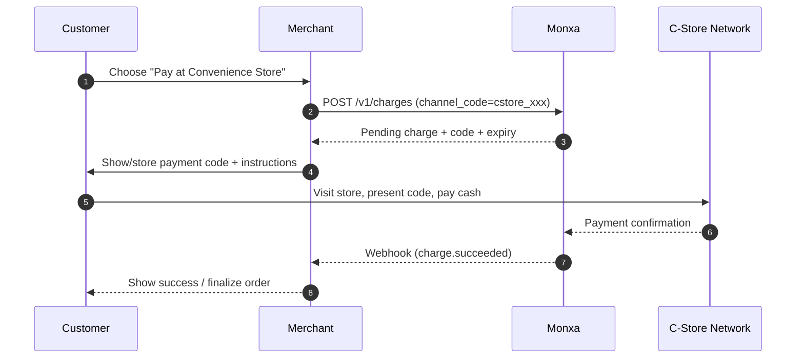

Convenience Store (C-Store) payments let customers generate a payment code online and complete their purchase by paying cash or electronically at a participating convenience store chain. This method is widely used in markets such as **Indonesia, Japan, and the Philippines**, where offline-to-online (O2O) flows are common.

## Capabilities & Constraints

- **Flow type:** Deferred offline payment (generate code → pay at store → confirm via webhook).
- **Capture model:** **Direct capture only** once customer pays at the store.
- **Customer experience:** Customer receives a store code or payment slip → pays at cashier or kiosk → provider posts success.
- **Settlement:** According to the local store provider/bank aggregator rules.
- **Refunds/Reversals:** **Not supported** (once customer has paid cash at store, no reversal is possible). Refunds, if needed, must be handled outside Monxa.
- **Expiry:** Each store payment code has an expiry time (e.g., 24–48 hours). If not paid, the charge expires automatically.

<Columns cols={2}>
  <Card title="1. Create a Charge" icon="star" iconType="solid" href="#">
    Create a **charge** with virtual account channel code. Monxa requests a VA from the provider.
  </Card>
  <Card title="2. Present Payment Instructions " icon="receipt" iconType="solid" href="#">
    Show the customer the **bank name, VA number, and expiry** along with transfer instructions.
  </Card>
  <Card title="3. Customer Pays at Store" icon="store" iconType="solid" href="#">
    The customer transfers the exact (or open) amount to the VA via mobile banking or ATM.
  </Card>
  <Card title="4. Handle Webhooks" icon="anchor" iconType="solid" href="#">
    Monxa confirms via **webhook** when funds are received and updates your system.
  </Card>
</Columns>

## Supported Channels

<Tabs>
  <Tab title="🇮🇩 Indonesia">
    | Channel   | Code              | **Currency** | **Refund** | **Settlement** | Min Amount | Max  Amount |
    | :-------- | :---------------- | :----------- | :--------- | :------------- | :--------- | :---------- |
    | Alfamart  | `store_alfamart`  | IDR          | N.A        | T+5            | 10,000     | 5,000,000   |
    | Indomaret | `store_indomaret` | IDR          | N.A        | T+5            | 10,000     | 2,500,000   |
  </Tab>
</Tabs>

## Payment Flow



## Status Lifecycle

| Status      | When                           | Merchant Action             |
| :---------- | :----------------------------- | :-------------------------- |
| `pending`   | Code created; awaiting payment | Display code to customer    |
| `succeeded` | Store confirmed payment        | Fulfill order               |
| `failed`    | Store rejected / error         | Offer retry                 |
| `expired`   | Not paid within expiry         | Create new charge if needed |

### Step 1: Create a Charge

Create a charge with a C-Store `channel_code`. Specify amount, currency, and `reference_id`. The provider will return store-specific instructions and an expiry.

<Tip>
  **Endpoint: POST v1/charges**
</Tip>

<AccordionGroup>
  <Accordion title="Request Example : Convenience Store">
    ```bash
    curl https://api.monxa.io/v1/charges \
      -H "Authorization: Bearer sk_test_***" \
      -H "Content-Type: application/json" \
      -H "Idempotency-Key: chg-cstore-20251009" \
      -d '{
        "amount": 100000,
        "currency": "IDR",
        "reference_id": "INV-2025-1009-001",
        "channel_code": "store_alfamart",
        "channel_properties": {
          "customer_name": "Andi Setiawan"
        },
        "metadata": {
          "note": "Order #991"
        }
      }'
    ```
  </Accordion>
  <Accordion title="Response Example">
    ```json
    {
    	"id": "chg_01JBC9XH2MW01",
    	"object": "charge",
    	"reference_id": "INV-2025-1009-001",
    	"amount": 100000,
    	"currency": "IDR",
    	"status": "pending",
    	"channel_code": "store_alfamart",
    	"actions": {
      		"type": "PRESENT_TO_CUSTOMER",
        	"display_code": "123456789012",
        	"instructions": "Present this code at Alfamart cashier before expiry",
        	"expires_at": "2025-10-10T23:59:59Z"
      	},
      	"created_at": "2025-10-09T10:15:00Z"
    }
    ```
  </Accordion>
</AccordionGroup>

### Step 2: Presents Payment Instructions

Show the `display_code` and store instructions to the customer. Example UX:

- **Online checkout:** Display code + barcode/QR for scanning at store.
- **Email/SMS:** Send code and expiry details so the customer can pay offline.

### Step 3: Customer Pays at Store

Customer visits the selected convenience store, presents the code to cashier or self-service kiosk, and pays the required amount in cash or supported digital methods.

### Step 4: Handle Webhooks & Confirm Status

**Webhook events:**

- `charge.succeeded` — Payment confirmed (safe to fulfill).
- `charge.failed` — Store rejected or technical error.
- `charge.expired` — Customer did not pay before expiry.

<AccordionGroup>
  <Accordion title="Sample Webhook (charge.succeeded)">
    ```json
    {
    	"id": "evt_01JBCAXYZ001",
    	"type": "charge.succeeded",
    	"data": {
    		"id": "chg_01JBC9XH2MW01",
    		"reference_id": "INV-2025-1009-001",
    		"amount": 100000,
    		"currency": "IDR",
    		"status": "succeeded",
    		"channel_code": "store_alfamart",
    		"paid_at": "2025-10-09T15:22:33Z"
    	},
    	"created_at": "2025-10-09T15:22:34Z"
    }
    
    ```
  </Accordion>
</AccordionGroup>

<Tip>
  Always verify with `GET /v1/charges/{id}` before updating your order state.
</Tip>

## Refunds

**❗Not supported.**\
Once the customer pays cash at a store, funds are final. Any refund must be arranged directly with the customer outside Monxa.

## Error Handling

| Error                     | Meaning                                            | How to Fix             |
| :------------------------ | :------------------------------------------------- | :--------------------- |
| `400 unsupported_channel` | Channel not available in your corridor             | Enable correct channel |
| `402 amount_out_of_range` | Amount outside allowed limits (e.g., \<IDR 10,000) | Adjust amount          |
| `409 duplicate_reference` | Same `reference_id` already used (if enforced)     | Use unique ref         |