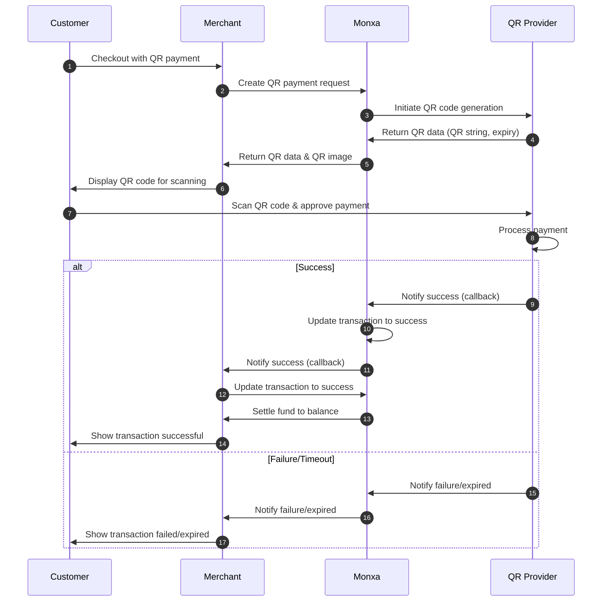

## Overview

Embedded QR code payments let you accept QR-based transactions **directly inside your platform** without redirecting customers to external pages.

At a broad level, incorporating QR code payments into your system follows a four-step process:

<Columns cols={2}>
  <Card title="1. Create a Charge" icon="star" iconType="solid" href="#">
    Create a **charge** with QR channel code. Monxa will return both the **QR string** and **QR image**.
  </Card>
  <Card title="2. Display the QR Code" icon="qrcode" iconType="solid" href="#">
    Show the QR code to the customer on your checkout page.
  </Card>
  <Card title="3. Customer Scans & Pays" icon="camera" iconType="solid" href="#">
    The customer scans the QR code and authorizes payment via their bank or wallet app.
  </Card>
  <Card title="4. Handle Webhooks" icon="anchor" iconType="solid" href="#">
    Monxa notifies you via **webhook** when the payment succeeds or fails. Update your system accordingly.
  </Card>
</Columns>

## Supported Channels

Not all payment methods support embedded QR payments. The following methods are available:

<Tabs>
  <Tab title="🇮🇩 Indonesia">
    | Channel   | Code        | **Currency** | **Refund**    | **Settlement** | Min Amount | Max  Amount |
    | :-------- | ----------- | :----------- | :------------ | :------------- | ---------- | :---------- |
    | QRIS      | `qris_qr`   | IDR          | Not supported | T+2            | 100        | 20,000,000  |
    | ShopeePay | `shopee_qr` | IDR          | Not supported | T+2            | 100        | 20,000,000  |
  </Tab>
  <Tab title="🇹🇭 Thailand">
    | **Channel** | Code           | **Currency** | **Refund**    | **Settlement** | Min Amount | Max Amount |
    | :---------- | -------------- | :----------- | :------------ | :------------- | :--------- | ---------- |
    | PromptPay   | `promptay_qr`  | THB          | Not supported | T+2            | 1          | 50,000     |
    | TrueMoney   | `truemoney_qr` | THB          | Not supported | T+2            | 1          | 70,000     |
  </Tab>
</Tabs>

## Payment Flow



### Step 1: Create a Charge

This is the initial stage of the payment process. After gathering all the user’s details and preparing to collect payment, use this API to generate a **charge**.

<Tip>
  **Endpoint: POST v1/charges**
</Tip>

<AccordionGroup>
  <Accordion title="Request Parameters" iconType="solid">
    | Parameter              | Type   | Required    | Description                                                                                                                                                                                                                   |
    | ---------------------- | ------ | ----------- | ----------------------------------------------------------------------------------------------------------------------------------------------------------------------------------------------------------------------------- |
    | **amount**             | string | required    | The amount to be paid.                                                                                                                                                                                                        |
    | **currency**           | string | required    | The currency of the payment (e.g., “sgd”).                                                                                                                                                                                    |
    | **channel_code**       | string | required    | Payment method code used to select the payment method provider.  (e.g. "qr_qris").                                                                                                                                            |
    | **channel_properties** | object | conditional | Parameters that contain information required by the payment route provider to initiate payment processing.                                                                                                                    |
    | reference_id           | string | optional    | Merchant's payment reference ID                                                                                                                                                                                               |
    | order_id               | string | optional    | Order ID in Monxa associated with this charge                                                                                                                                                                                 |
    | customer_id            | string | optional    | Customer ID in Monxa associated with this charge                                                                                                                                                                              |
    | description            | string | optional    | A custom description for the charge.                                                                                                                                                                                          |
    | metadata               | object | optional    | Key-value entries for your custom data.   You can specify up to 50 keys, with key names up to 40 characters and values up to 500 characters.   This is for your convenience. Monxa will not use this data for any processing. |
  </Accordion>
  <Accordion title="Request Example">
    ```json
    {
    	"reference_id" : "TRX-983921-221A",
    	"amount" : "124000.00",
    	"currency" : "IDR",
    	"channel_code" : "QR_QRIS",
    	"description" : "Simple description for the payment"
    }
    ```
  </Accordion>
  <Accordion title="Response Example">
    <Tip>
      The response includes a qr_data that contains the information needed to generate a scannable QR code (qr_data).
    </Tip>
    ```json
    {
    	"charge_id": "chg_9c262fb5-f3cd-4187",
      	"reference_id": "TRX-983921-221A",
    	"order_id": null,
    	"customer_id": null,
    	"currency": "IDR",
    	"amount": 124000.00,
    	"channel_code": "QR_QRIS",
    	"channel_properties": {
    		"expires_at" : "2026-05-28T14:37:11"
    	},
    	"metadata": null,
    	"status": "ACTION_REQUIRED",
    	"actions": {
    		"type": "PRESENT_TO_CUSTOMER",
    		"qr_data": "000201010212266CO.MONXAxxx",
    		"qr_image": "data:image/png;base64,iVBORw0Kxxxx",
    	},
    	"created": "2024-05-28T14:37:11",
    	"updated": "2024-05-28T14:37:11"
    }
    ```
  </Accordion>
</AccordionGroup>

### Step 2: Generate & Display the QR Code

After creating the payment request, use the response data to generate a QR code and present it to the user.

<Warning>
  **🔎 Sandbox Behavior**

  - In the **Sandbox environment**, the `qr_data` value returned may be a URL (e.g., `https://checkout.monxa.io/...`) instead of the raw PayNow QR string.
  - This allows you to test the flow easily using any standard QR code scanner or by opening the link directly in a browser.

  **🚀 Production Behavior**

  - In **Production**, the `qr_data` value will be a **raw PayNow payload string**.
  - You must convert this string into a scannable QR code for use with supported banking apps.
</Warning>

### Step 3: Customer Scans to Pay

The customer scans the QR code with their banking app to initiate and confirm the payment.

### Step 4: Handle Webhooks & Update Payment Status

After the payment is completed, your system must handle **webhooks** to receive payment notifications and keep the order status in sync.

<Tip>
  **Tip:** For general information on webhooks and best practices for handling them, refer to the [Webhook Guide ](/integration/webhooks)page.
</Tip>

<AccordionGroup>
  <Accordion title="Webhook Parameters">
    | **Parameter**        | **Description**                                                                  | **Example Value**              |
    | -------------------- | -------------------------------------------------------------------------------- | ------------------------------ |
    | `payment_id`         | Unique identifier of the payment.                                                | `pay_1234567890`               |
    | `payment_request_id` | Unique identifier of the payment request.                                        | `req_0987654321`               |
    | `phone`              | Buyer’s phone number.                                                            | `+6591234567`                  |
    | `amount`             | Amount related to the payment.                                                   | `100.00`                       |
    | `currency`           | Currency of the payment.                                                         | `SGD`                          |
    | `status`             | Payment status (`completed` / `failed`).                                         | `completed`                    |
    | `reference_number`   | Custom reference number mapped during payment request creation.                  | `ORDER12345`                   |
    | `hmac`               | Message Authentication Code (MAC) of this webhook request (used for validation). | `a1b2c3d4e5f67890abcdef123456` |
  </Accordion>
  <Accordion title="Sample Webhook (charge.succeeded)">
    
  </Accordion>
</AccordionGroup>

## Refunds / Reversal

QR payments are **push-based transfers**, meaning the customer initiates the payment from their banking or wallet app by scanning the QR code. Because of this, **refunds or reversals are not supported through Monxa’s API**.

- Once the customer confirms the payment, the transaction is **final** and cannot be automatically reversed.
- If a refund is required (e.g., order cancellation, duplicate payment, or overpayment), the merchant must process a **manual refund** by transferring the funds back to the customer’s bank or wallet account outside of Monxa.
- Monxa provides complete **reporting and webhook notifications** to track the payment lifecycle, but it does not support automated refunds for QR transactions.

<Warning>
  **Important**: Always make it clear to your customers that QR payments are non-reversible. If you need to support refunds, set up a manual refund workflow where you collect customer bank/wallet details and process the refund directly.
</Warning>