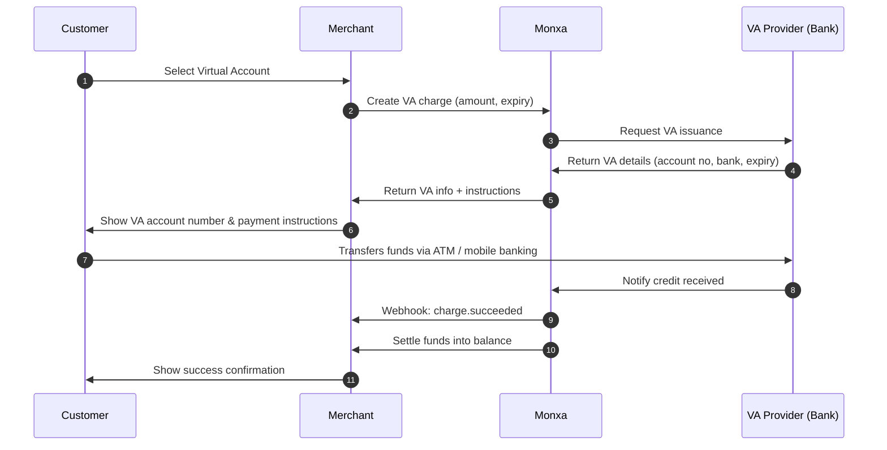

Virtual Accounts allow customers to pay by transferring funds into a **unique bank account number** assigned by Monxa. The VA can be **dynamic** (single-use) or **static** (reusable). When the customer makes a transfer, the provider notifies Monxa, and Monxa updates the merchant via webhook.

## When to Use Virtual Accounts

✅ High-value transfers (enterprise/B2B)\
✅ ATM or mobile-banking–friendly markets\
✅ Offline customers with no card/e-wallet\
✅ Need for strong reconciliation (invoice-to-VA mapping)

## Supported Channels

<Tabs>
  <Tab title="🇮🇩 Indonesia">
    | Channel  | Code          | **Currency** | **Refund** | **Settlement** | Min Amount | Max  Amount    |
    | :------- | ------------- | :----------- | :--------- | :------------- | ---------- | :------------- |
    | BCA      | `bca_va`      | IDR          | N/A        | T+1            | 1          | 50,000,000     |
    | BJB      | `bjb_va`      | IDR          | N/A        | T+1            | 1          | 2,000,000,000  |
    | BNC      | `bnc_va`      | IDR          | N/A        | T+1            | 1          | 50,000,000,000 |
    | BNI      | `bni_va`      | IDR          | N/A        | T+1            | 1          | 50,000,000     |
    | BRI      | `bri_va`      | IDR          | N/A        | T+1            | 1          | 50,000,000,000 |
    | BSI      | `bsi_va`      | IDR          | N/A        | T+1            | 1          | 50,000,000,000 |
    | BSS      | `bss_va`      | IDR          | N/A        | T+1            | 1          | 50,000,000,000 |
    | CIMB     | `cimb_va`     | IDR          | N/A        | T+1            | 1          | 50,000,000,000 |
    | MANDIRI  | `mandiri_va`  | IDR          | N/A        | T+1            | 1          | 50,000,000,000 |
    | MUALAMAT | `mualamat_va` | IDR          | N/A        | T+1            | 1          | 50,000,000,000 |
    | PERMATA  | `permata_va`  | IDR          | N/A        | T+1            | 1          | 50,000,000,000 |
  </Tab>
  <Tab title="🇹🇭 Thailand">
    | **Channel** | Code     | **Currency** | **Refund** | **Settlement** | Min Amount | Max Amount |
    | :---------- | -------- | :----------- | :--------- | :------------- | :--------- | ---------- |
    | SCB         | `scb_va` | THB          | N/A        | T+1            | 20         | 700,000    |
  </Tab>
</Tabs>

## Payment Flow

## API Endpoints & Sample Payloads