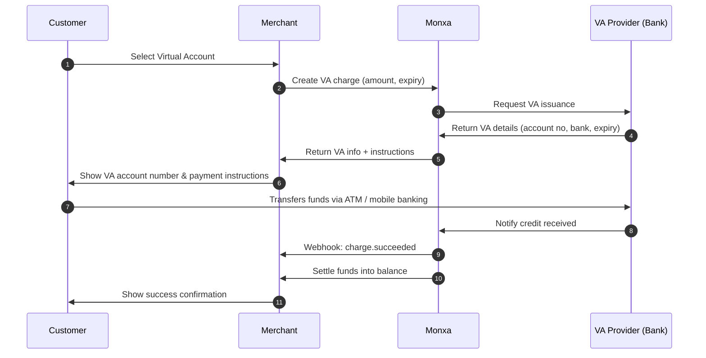

## Overview

Virtual Accounts (VAs) allow customers to complete payments by making a **bank transfer** into a unique account number issued for their transaction.\
This method is widely used across Asia because it is **familiar, trusted, and supports large-value payments**.

Monxa simplifies VA payments by:

- **Issuing dynamic or static VA numbers** through integrated banks and providers.
- **Returning ready-to-display VA details** (bank code, account number, expiry, instructions).
- **Listening for provider notifications** when funds are credited.
- **Sending webhook events** so your system always knows the real-time status.

<Columns cols={2}>
  <Card title="1. Create a Charge" icon="star" iconType="solid" href="#">
    Create a **charge** with virtual account channel code. Monxa requests a VA from the provider.
  </Card>
  <Card title="2. Display VA Information" icon="building-columns" iconType="solid" href="#">
    Show the customer the **bank name, VA number, and expiry** along with transfer instructions.
  </Card>
  <Card title="3. Customer Transfers Funds" icon="money-bill-transfer" iconType="solid" href="#">
    The customer transfers the exact (or open) amount to the VA via mobile banking or ATM.
  </Card>
  <Card title="4. Handle Webhooks" icon="anchor" iconType="solid" href="#">
    Monxa confirms via **webhook** when funds are received and updates your system.
  </Card>
</Columns>

## Supported Channels

<Tabs>
  <Tab title="🇮🇩 Indonesia">
    | Channel  | Code          | **Currency** | **Refund** | **Settlement** | Min Amount | Max  Amount |
    | :------- | ------------- | :----------- | :--------- | :------------- | ---------- | :---------- |
    | BCA      | `bca_va`      | IDR          | N/A        | T+1            | 1          | 50,000,000  |
    | BJB      | `bjb_va`      | IDR          | N/A        | T+1            | 1          | 500,000,000 |
    | BNC      | `bnc_va`      | IDR          | N/A        | T+1            | 1          | 500,000,000 |
    | BNI      | `bni_va`      | IDR          | N/A        | T+1            | 1          | 50,000,000  |
    | BRI      | `bri_va`      | IDR          | N/A        | T+1            | 1          | 500,000,000 |
    | BSI      | `bsi_va`      | IDR          | N/A        | T+1            | 1          | 500,000,000 |
    | BSS      | `bss_va`      | IDR          | N/A        | T+1            | 1          | 500,000,000 |
    | CIMB     | `cimb_va`     | IDR          | N/A        | T+1            | 1          | 500,000,000 |
    | MANDIRI  | `mandiri_va`  | IDR          | N/A        | T+1            | 1          | 500,000,000 |
    | MUALAMAT | `mualamat_va` | IDR          | N/A        | T+1            | 1          | 500,000,000 |
    | PERMATA  | `permata_va`  | IDR          | N/A        | T+1            | 1          | 500,000,000 |
  </Tab>
  <Tab title="🇹🇭 Thailand">
    | **Channel** | Code     | **Currency** | **Refund** | **Settlement** | Min Amount | Max Amount |
    | :---------- | -------- | :----------- | :--------- | :------------- | :--------- | ---------- |
    | SCB         | `scb_va` | THB          | N/A        | T+1            | 20         | 700,000    |
  </Tab>
</Tabs>

## Payment Flow



### Step 1: Create a Charge

<Tip>
  **Endpoint: POST v1/charges**
</Tip>

<AccordionGroup>
  <Accordion title="Request Example : Dynamic VA">
    ```bash
    curl -X POST https://api.monxa.co/v1/charges \
      -H "Authorization: Bearer sk_test_***" \
      -H "Content-Type: application/json" \
      -d '{
        "amount": 250000,
        "currency": "IDR",
        "payment_method": "virtual_account",
        "va": {
          "bank_code": "BCA",
          "account_type": "dynamic",
          "amount_type": "exact",
          "expires_at": "2025-10-15T23:59:59Z"
        },
        "metadata": { "invoice_id": "INV-10092" }
      }'
    ```
  </Accordion>
  <Accordion title="Response Example">
    ```json
    {
      "id": "ch_001",
      "object": "charge",
      "status": "PENDING",
      "amount": 250000,
      "currency": "IDR",
      "payment_method": "virtual_account",
      "va": {
        "bank_code": "BCA",
        "account_number": "1234567890123",
        "account_name": "MONXA COLLECTION",
        "expires_at": "2025-10-15T23:59:59Z",
        "instructions": [
          "Open BCA mobile app or ATM.",
          "Choose Virtual Account transfer.",
          "Enter account number: 1234567890123",
          "Confirm amount: 250,000 IDR"
        ]
      }
    }
    ```
  </Accordion>
</AccordionGroup>

### Step 2: Display VA Information

Once the charge is created, show the returned **bank name, account number, expiry date, and instructions** to the customer.

This allows the customer to transfer funds using their preferred channel:

- ATM
- Mobile banking app
- Internet banking

<Tip>
  Make sure to clearly show the **exact amount** if you are using a **closed/exact VA**.
</Tip>

### Step 3: Customer Transfers Funds

The customer proceeds to their banking channel and makes a transfer to the VA account number provided.

- For **dynamic/exact VAs**, the amount must match exactly.
- For **static/open VAs**, any incoming payment is accepted and must be reconciled against the customer/order.

<Tip>
  The bank / VA provider will notify Monxa once funds are received.
</Tip>

### Step 4: Handle Webhooks & Update Payment Status

When the VA provider confirms the credit, Monxa updates the charge status and sends a **webhook notification** to your server.

- Typical webhook events:
  - `charge.succeeded` → funds received successfully
  - `charge.expired` → VA expired without payment

## Refunds / Reversal