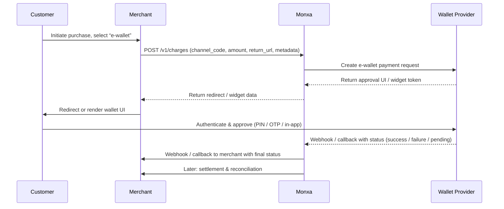

## Overview

An **e-wallet** (digital wallet) allows users to store value or link funding sources and authorize payments using the stored wallet or linked instruments. In many markets, e-wallets are a preferred method due to convenience, familiarity, and strong authentication.

By offering e-wallet payments via Monxa, merchants can:

- Provide a frictionless checkout experience
- Tap into local wallet popularity in Asia
- Leverage Monxa’s settlement, reconciliation, and refund capabilities in one unified system

## Integration Architecture

Below is a simplified architecture showing how Monxa, the merchant, and the wallet provider interact:

---

## API Endpoints & Sample Payloads

(_Note: these are illustrative. Confirm actual parameter names with Monxa’s API Reference._)

### Initiate e-wallet Payment

**Request**