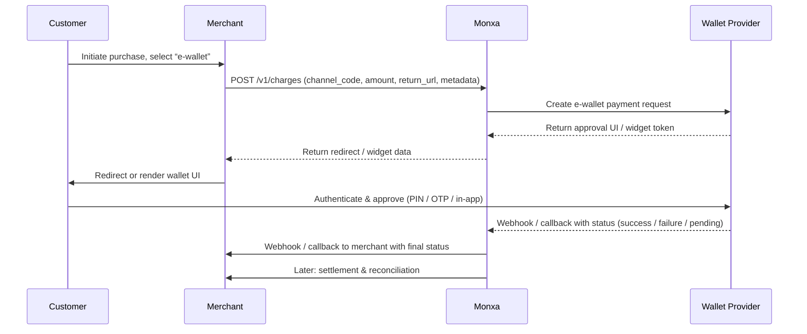

## Overview

An **e-wallet** (digital wallet) allows users to store value or link funding sources and authorize payments using the stored wallet or linked instruments. In many markets, e-wallets are a preferred method due to convenience, familiarity, and strong authentication.

By offering e-wallet payments via Monxa, merchants can:

- Provide a frictionless checkout experience
- Tap into local wallet popularity in Asia
- Leverage Monxa’s settlement, reconciliation, and refund capabilities in one unified system

## Integration Architecture

Below is a simplified architecture showing how Monxa, the merchant, and the wallet provider interact:



---

## API Endpoints & Sample Payloads

(_Note: these are illustrative. Confirm actual parameter names with Monxa’s API Reference._)

```http
POST /v1/charges
```

<AccordionGroup>
  <Accordion title="Request Example : Charge‑only (DANA)">
    ```bash
    curl https://api.monxa.io/v1/charges \
      -H "Content-Type: application/json" \
      -H "Idempotency-Key: chg-12345-unique-key" \
      -d '{
        "amount": 150000,
        "currency": "IDR",
        "channel_code": "dana",
    	"channel_properties": {
    		"return_url": ""
    	}
        "reference_id": "INV-240001",
        "metadata": { "field_1": "A1234", field_2: "user@example.com" }
      }'
    ```
  </Accordion>
  <Accordion title="Response Example">
    ```json
    {
      "id": "chg_01JAB1XYN01P3",
      "reference_id": "INV-240001",
      "amount": 150000,
      "currency": "IDR",
      "status": "pending",
      "channel_code": "dana",
      "actions": {
        "type": "REDIRECT_CUSTOMER",
       	"redirect_url": "",
        "expires_at": "2025-10-07T09:15:00Z"
      },
      "created_at": "2025-10-07T09:10:00Z"
    }
    ```
  </Accordion>
</AccordionGroup>

## Webhook Notification

Monxa will send an asynchronous webhook to your configured endpoint:

**Handling Logic (Merchant Side)**

- On `SUCCESS`: mark order paid, fulfill goods
- On `FAILED` or `CANCELLED`: notify user, optionally prompt fallback
- On `PENDING`: you may poll or await final callback

## Refunds / Reversal

If the e-wallet provider supports refunds back to wallet:

```http
POST /v1/refunds
```

<AccordionGroup>
  <Accordion title="Request Example : Refund">
    ```bash
    curl https://api.monxa.io/v1/refunds \
      -H "Content-Type: application/json" \
      -H "Idempotency-Key: ref-12345-unique-key" \
      -d '{
        "charge_id": "chg_01JAB1XYN01P3",
        "currency": "IDR",
        "amount": "50000",
        "reference_id": "INV-240001",
    	"description": "",
        "metadata": { "field_1": "A1234", field_2: "user@example.com" }
      }'
    ```
  </Accordion>
  <Accordion title="Response Example">
    ```json
    {
      "id": "ref_01JAB1XYN01P3",
      "reference_id": "INV-240001",
      "amount": 150000,
      "currency": "IDR",
      "status": "pending",
      "channel_code": "dana",
      "actions": {
        "type": "REDIRECT_CUSTOMER",
       	"redirect_url": "",
        "expires_at": "2025-10-07T09:15:00Z"
      },
      "created_at": "2025-10-07T09:10:00Z"
    }
    ```
  </Accordion>
</AccordionGroup>

## Merchant Best Practices

- Place e-wallet options prominently in checkout, especially in regions where they are popular
- Use deep linking / SDK embed flows to minimize context switching
- Pre-validate wallet availability (region, currency, user status) before initiating the flow
- Handle `PENDING` status gracefully (polling, UI feedback)
- Log analytics around wallet provider, time to approve, dropoffs
- Provide alternative payment options if e-wallet fails
- If refund-to-wallet isn’t supported, define clear fallback behavior (e.g. bank refund)
- Be cautious of transaction limits (some wallets limit per day / per transaction)
- Test across multiple devices, network conditions, and wallet states (e.g. insufficient balance)